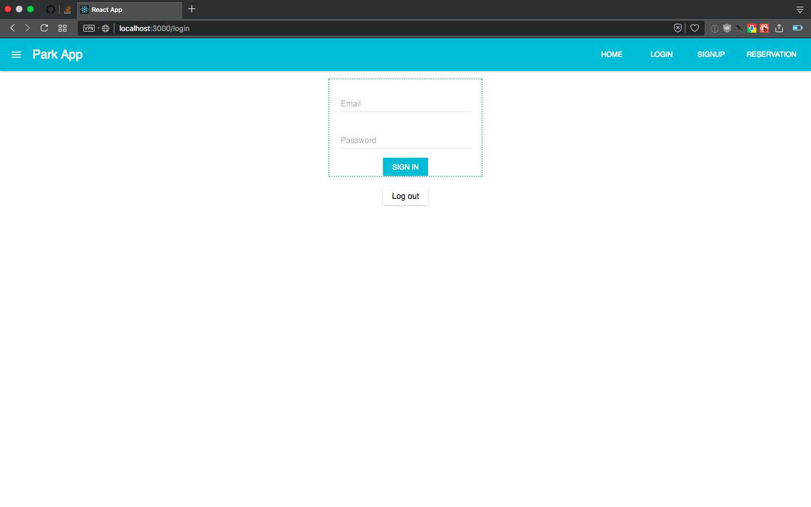
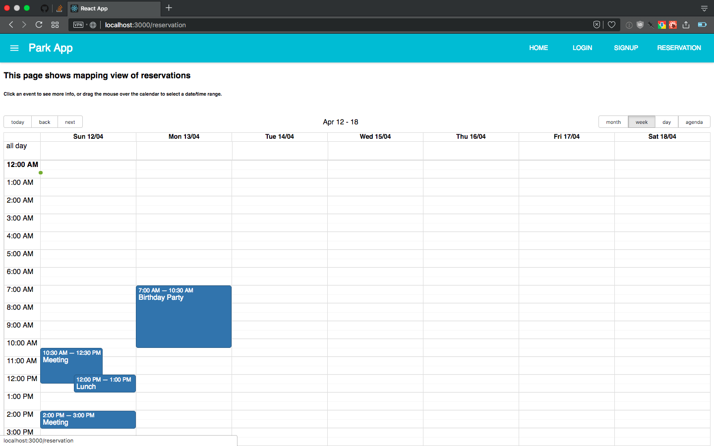

# Parking reservation 
> Frontend portion of Parking reservation web app

# Running locally:

```
> git clone https://github.com/vnbhattarai/parkapp-frontend

> cd parkapp-frontend

> yarn install

> yarn start
```

Then navigate to <http://localhost:3000>

# Note ✋:

You will need to be running local feathersjs instance with database of your choice 

# What's Inside ?
This is project is WIP.
Regardless, screenshots from local instance of project are below:

### Home Page (will be updated)


### Reservation Page (UI for space selection in in progress)
